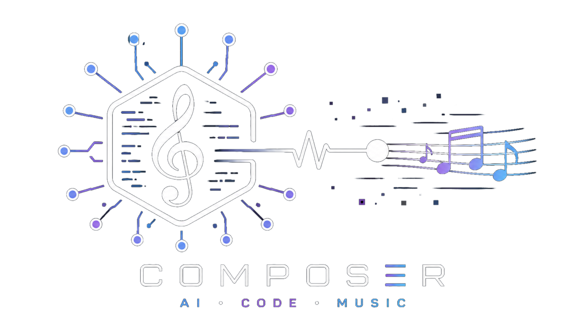
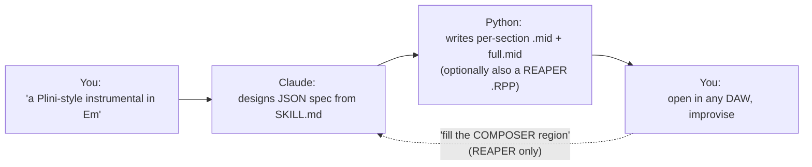

<p align="center">
  
</p>

<h1 align="center">claude-composer</h1>

<p align="center">
  <em>A bandmate that hands you sketches.</em>
</p>


<p align="center">
  <a href="https://youtu.be/sGqa-7_V1t8">
    
  </a>
</p>

<p align="center">
  <a href="https://youtu.be/sGqa-7_V1t8" title="Watch the demo on YouTube">
    
  </a>
  <br>
  <sub><em>↑ click to play (opens YouTube)</em></sub>
</p>

<p align="center">
  <a href="https://github.com/ricardoalcocer/claude-code-composer/actions/workflows/ci.yml">
    
  </a>
  
  <a href="https://alco.mit-license.org">
    
  </a>
  <a href="https://claude.ai/code">
    
  </a>
</p>

<p align="center"><em>Works with any DAW that opens MIDI:</em></p>

<p align="center">
  <a href="https://www.reaper.fm/"></a>
  <a href="https://www.apple.com/logic-pro/"></a>
  <a href="https://www.ableton.com/"></a>
  <a href="https://www.steinberg.net/cubase/"></a>
  <a href="https://www.image-line.com/fl-studio/"></a>
  <a href="https://www.apple.com/mac/garageband/"></a>
  <a href="https://www.bitwig.com/"></a>
</p>

<p align="center"><em>What's inside:</em></p>

<p align="center">
  
  
  
  
</p>

<p align="center">
  Tell <a href="https://claude.ai/code">Claude Code</a> what you want to play over — a style, a mood, a chord change — and get back MIDI: bass, drums, guitars, pad, lead, laid out across sections. Drop it into <strong>any DAW</strong> (<a href="https://www.apple.com/logic-pro/">Logic</a>, <a href="https://www.ableton.com/">Ableton</a>, <a href="https://www.steinberg.net/cubase/">Cubase</a>, <a href="https://www.image-line.com/fl-studio/">FL Studio</a>, <a href="https://www.apple.com/mac/garageband/">GarageBand</a>, <a href="https://www.bitwig.com/">Bitwig</a>…), or open the bundled <a href="https://www.reaper.fm/">REAPER</a> project for a one-click playable session. Improvise over it. Mine it for ideas. Throw it away. Ask for another.
</p>

---

## Recently added

- **Programmatic drum fills auto-spliced at section transitions** — 7-pattern catalog (`FILL_PATTERNS`) informed by standard rock-fill pedagogy. Default ON; the compose pipeline detects every form transition and replaces the last 2 beats of the outgoing section with a fill, rotating through the catalog for variety. No external file dependencies, no manual drag, reproducible from spec. Opt out per song with `auto_fills: false`.
- **Intra-section arrangement variation catalog** — 15 named moves (wedge entry, mid-section drop, delayed lead entry, drop-into-silence, plateau-burst, call-and-response, stratification, more) plus a 6th Hooktheory axis: **Arrangement Pacing**.
- **Andy Timmons baked in + Timmons clause** — Rock pack touchstones extended; FORBIDDEN-list exception that permits `I-V-vi-IV` when paired with a composed vocal-style melody. The chord cliché becomes the vessel; the melody is the song.
- **Mood → progression seed bank** — `data/shld_mood_bank.json`: 127 progressions across 19 emotional moods (Mysterious, Nostalgic, Sad, Triumphant, Hopeful, Dark, Romantic, Surprised, Cadence, …), distilled from 7,620 labeled reference MIDIs.
- **MIDI-only mode + bundled starter template** — REAPER now optional; `composer.py compose --midi-only` works without `config.json`. The repo ships `assets/starter_template.RPP` so REAPER users can run `compose` immediately.

See [CHANGELOG.md](CHANGELOG.md) for the full evolution — Cinematic-pack subschools, Andy/Jack/Zimmer/Yiruma/Skyfall/Dream Theater/APP/Symphony X verified idioms, Neoclassical-metal moves, the Hooktheory composition framework, bass-line-first design, and earlier batches.

---

## How it works



The Python script does the mechanical MIDI work. Every musical decision — key, tempo, chord choices, form, feel-arc, arrangement, voicings — happens inside Claude, guided by the catalogs in [`SKILL.md`](SKILL.md). The `.RPP` is a convenience for REAPER users; **the `.mid` files are the universal artifact**.

## What it feels like

You're in Claude Code. You type:

> *Give me a Plini-style instrumental in Bm — through-composed, no lead, leave room for me to play over it.*

A few seconds later you have `~/Documents/MIDI-SONGS/_2026/.../blue-meridian/` on disk — 48 bars across six unique sections, drums entering at the halftime setup, full band at the climb, a sparse bridge break in the middle. The folder holds per-section `.mid` files, a `full.mid` you can drag straight into [Logic](https://www.apple.com/logic-pro/) / [Ableton](https://www.ableton.com/) / [Cubase](https://www.steinberg.net/cubase/) / [GarageBand](https://www.apple.com/mac/garageband/) / [Bitwig](https://www.bitwig.com/), and `spec.json` with every chord and the scale to solo over it. (If you set up REAPER, you also get a `.RPP` with everything wired to tracks and a NOTES pane that displays the chord/scale guidance inline.)

Then you decide the bridge needs more. In REAPER you drag a region named `COMPOSER` over 16 empty bars and ask:

> *Fill the COMPOSER region with a cinematic key mod.*

Claude reads what comes before and after the gap, picks a chromatic-mediant lift to D major then drops to Bb-major territory before walking back through B Aeolian, and writes the MIDI items into your project on bass, pad, clean, and synth pad — no drums, no rhythm guitars, because the brief said *cinematic*. The fill lands cleanly into the next chord on the other side. *(Fill mode is REAPER-specific — it rewrites the `.RPP` in place. The Compose flow works in any DAW.)*

That's the whole skill: a bandmate that hands you sketches.

## Use cases — briefs that reach into the depth

The skill has grown a lot of named idioms, archetypes, and moves. Most "give me a rock song in Em" briefs only graze the surface. These briefs reach into the corners of the catalog you'd otherwise have to know existed to ask for:

- *"Andy Timmons style in A — vocal-style instrumental melody on a I-V-vi-IV loop"* → activates the **Timmons clause** (the FORBIDDEN-progression exception), single-guitar integration (drops rhy guitars; clean + lead carry harmony together), target-note resolution per phrase.
- *"Modal-cinematic Zimmer build in C minor — single-loop iterated, no V chord, glacial harmonic rhythm"* → **Cinematic subschool A**, Drone Build archetype, modal Aeolian discipline, hollow-middle voicings — same 4-bar loop iterated 7+ times, climax via texture density only.
- *"Casiopea-meets-Plini in F#m — locked-16 J-fusion engine under melodic-rock harmony"* → cross-pack fusion (**J-fusion engine + Rock harmony**), composed lead melody mandatory, full voicings, j-fusion-kit drums with upbeat accents.
- *"Modal Shapeshift on D — Dorian verse, Aeolian chorus, Phrygian-dom bridge, same tonic throughout"* → **APP "Walrus"-derived archetype**, single tonic / multiple modes, distinct melody per mode that leans on each mode's signature note (B-natural for Dorian, B-flat for Aeolian, E-flat for Phrygian-dom).
- *"Yiruma-style piano in A — vi-I/3-I-V loop, tonic permanently in 1st inversion"* → **Cinematic subschool B**, verbatim Yiruma LH 3-note arpeggio (root → 5th → 10th with breath rests), single descending-inversion bridge as the only chromatic motion.
- *"Spanish bridge in a Plini-rock song in Bm"* → **pack mixing** — verses/choruses in Rock pack, bridge invokes Spanish pack (Andalusian cadence, Phrygian-dom V) for the section only.
- *"Pull a Mysterious-Hopeful progression from the mood bank in Em — something I haven't heard"* → **mood bank lookup** (127 distilled progressions across 19 emotional moods, indexed in `data/shld_mood_bank.json`), pre-screened against the FORBIDDEN list.
- *"16-bar Bm verse with mid-section kick drop and delayed lead entry on bar 9"* → **intra-section arrangement vocabulary**, the new 6th Hooktheory axis (Arrangement Pacing), `move` field carries the mute/automation cues the user wires in REAPER.
- *"Cinematic-pop chorus with the Skyfall stepwise descent in Cm"* → **Cinematic subschool C**, Bond chord (harmonic-minor V7 = G7 with B-natural in Cm), 8-chord stepwise chorus descent (i-bVII-bVI-V-iv-bIII-ii-V7).
- *"Math rock in 7/8 with maj9 voicings, drone build, no V chord"* → Math rock pack + Drone Build archetype + modal-Aeolian discipline — three packs cross-cutting.

If your brief feels generic, scan this list for a starting angle that exercises something interesting. The depth is in the combinations.

## Two modes

| Mode | When | What you say | What you get | DAW |
|---|---|---|---|---|
| **Compose** | Starting fresh | *"a sad piano piece in 6/8"* · *"Polyphia-style loop"* · *"synthwave in Am"* · *"Zaza meets Casiopea in Em"* | Per-section `.mid` files + `full.mid` + `spec.json` + (optionally) a REAPER `.RPP` | **Any** ([Logic](https://www.apple.com/logic-pro/), [Ableton](https://www.ableton.com/), [Cubase](https://www.steinberg.net/cubase/), [FL](https://www.image-line.com/fl-studio/), [GarageBand](https://www.apple.com/mac/garageband/), [Bitwig](https://www.bitwig.com/), [REAPER](https://www.reaper.fm/)…) |
| **Fill** | Filling a gap in an existing project | *"fill the COMPOSER region"* · *"do a key mod here"* · *"arpeggiated guitars, 65bpm feel"* | MIDI items injected into the existing `.RPP` in place — only the tracks the fill needs | **REAPER only** (writes into `.RPP` structure directly) |

## Style packs

Each pack is a self-contained recipe — tempo range, default key, roles, feel archetypes, harmonic moves, voicings, what to avoid, and touchstones. Packs **blend at section boundaries** (*"Spanish bridge in a synthwave song"* is a valid brief).

### Melodic-rock family

<table>
  <tr>
    <th>Pack</th>
    <th>Touchstones</th>
    <th>Engine</th>
  </tr>
  <tr>
    <td><strong>Rock</strong> <sub>(default)</sub></td>
    <td>Satriani · Vai · Plini · Polyphia · Zaza</td>
    <td>Driving 8ths · modal minor · pedal tones · <code>bVI-bVII-i</code> lift</td>
  </tr>
  <tr>
    <td><strong>Math rock</strong></td>
    <td>American Football · TTNG · Toe</td>
    <td>7/8 · fingerpicked · maj7/9 voicings · open-tuning vocabulary</td>
  </tr>
  <tr>
    <td><strong>Post-rock</strong></td>
    <td>Mogwai · Explosions in the Sky · Caspian</td>
    <td>Sparse build → climax → ebb · Mogwai inversion</td>
  </tr>
  <tr>
    <td><strong>Cinematic</strong> <sub>(3 subschools)</sub></td>
    <td>Zimmer · Einaudi · Sigur Rós · Yiruma · Hisaishi · Adele "Skyfall"</td>
    <td><em>A. modal</em>: no V, single-loop, hollow voicings · <em>B. diatonic</em>: vi-I/3-I-V loop · <em>C. cinematic-pop</em>: Bond chord + stepwise chorus descent</td>
  </tr>
</table>

### Heavy / electronic / world

<table>
  <tr>
    <th>Pack</th>
    <th>Touchstones</th>
    <th>Engine</th>
  </tr>
  <tr>
    <td><strong>Djent</strong></td>
    <td>Periphery · Animals as Leaders · Meshuggah · Tesseract</td>
    <td><code>chugg: gallop</code> · <code>polyrhythm-3</code> · halftime breakdowns</td>
  </tr>
  <tr>
    <td><strong>Spanish / Phrygian</strong></td>
    <td>Rodrigo y Gabriela · Paco de Lucía</td>
    <td>Phrygian dominant · Andalusian cadence · <code>chugg: gallop</code></td>
  </tr>
  <tr>
    <td><strong>Synthwave</strong></td>
    <td>Carpenter Brut · Kavinsky · Mitch Murder · Stranger Things</td>
    <td><code>four-on-floor</code> · halftime feel · layered EDM build</td>
  </tr>
</table>

### Fusion family

<table>
  <tr>
    <th>Pack</th>
    <th>Touchstones</th>
    <th>Engine</th>
  </tr>
  <tr>
    <td><strong>Jazz-funk</strong> <sub>(2 subschools)</sub></td>
    <td>Jack Thammarat · Tomo Fujita · Snarky Puppy · Cory Henry · Robben Ford</td>
    <td><em>A. Jack melodic-fusion</em>: Mixolydian I-♭VII-IV-V · quartal piano dyads · single-note arp · <em>B. modal-jazz</em>: ii-V-i chains · full m7 stacks · Coltrane changes</td>
  </tr>
  <tr>
    <td><strong>Reggae-fusion</strong></td>
    <td>John Scofield · Steve Khan · Pat Metheny</td>
    <td><code>feel: skank</code> (upbeat chops) · <code>drums: one-drop</code> · modal-jazz harmony on top</td>
  </tr>
  <tr>
    <td><strong>Salsa-fusion</strong></td>
    <td>Michel Camilo · Hiromi · Eddie Palmieri · Steve Khan</td>
    <td><code>feel: montuno</code> (piano arpeggio) · <code>chugg: clave-3-2</code> · <code>drums: latin-fusion</code></td>
  </tr>
  <tr>
    <td><strong>J-fusion</strong></td>
    <td>Casiopea · T-Square · Naniwa Express</td>
    <td><code>feel: locked-16</code> · <code>drums: j-fusion-kit</code> (16th hi-hat) · <strong>composed lead mandatory</strong></td>
  </tr>
</table>

> [!TIP]
> The three "fusion" packs (Reggae, Salsa, J-fusion) are explicitly **non-authentic** — you lift the rhythmic engine and drop your own harmonic language on top. Lydian-dom over a skank. Dorian over a montuno. Modal-rock harmony under a locked-16. *The combinations are the whole point.*

## Requirements

<table>
  <tr>
    <td><strong>Python 3.8+</strong></td>
    <td>Stdlib only — zero external dependencies, single file (<code>composer.py</code>).</td>
  </tr>
  <tr>
    <td><strong>Claude Code</strong></td>
    <td>The driver. <code>composer.py</code> can also be run standalone with a hand-written JSON spec — see <a href="#standalone-usage">Standalone usage</a>.</td>
  </tr>
  <tr>
    <td><strong>REAPER</strong> <em>(optional)</em></td>
    <td>Only needed if you want a playable <code>.RPP</code> project. <strong>If you prefer <a href="https://www.apple.com/logic-pro/">Logic</a> / <a href="https://www.ableton.com/">Ableton</a> / <a href="https://www.steinberg.net/cubase/">Cubase</a> / <a href="https://www.image-line.com/fl-studio/">FL Studio</a> / <a href="https://www.apple.com/mac/garageband/">GarageBand</a> / <a href="https://www.bitwig.com/">Bitwig</a></strong>, use <code>--midi-only</code> mode and skip REAPER entirely. <a href="https://www.reaper.fm/">reaper.fm</a></td>
  </tr>
  <tr>
    <td><strong>REAPER template</strong> <em>(optional)</em></td>
    <td>A starter template ships with the repo (<code>assets/starter_template.RPP</code>) — empty named tracks. Replace with your own once you've built one you like. See <a href="#template-setup">Template setup</a>.</td>
  </tr>
</table>

## Install

### Quickstart — non-REAPER users *([Logic](https://www.apple.com/logic-pro/), [Ableton](https://www.ableton.com/), [Cubase](https://www.steinberg.net/cubase/), [FL](https://www.image-line.com/fl-studio/), [GarageBand](https://www.apple.com/mac/garageband/), [Bitwig](https://www.bitwig.com/)…)*

```bash
git clone https://github.com/ricardoalcocer/claude-code-composer.git ~/.claude/skills/composer
cd ~/.claude/skills/composer

# That's it. No config.json, no template — just run:
python3 composer.py compose --midi-only /path/to/spec.json /path/to/output_dir
```

You get `full.mid`, per-section `.mid` files, and `spec.json` in the output directory. Drag the MIDI into your DAW.

### Quickstart — REAPER users

```bash
git clone https://github.com/ricardoalcocer/claude-code-composer.git ~/.claude/skills/composer
cd ~/.claude/skills/composer
cp config.example.json config.json
cp style.example.md style.md
# config.json already points at the bundled starter template — you can run immediately:
python3 composer.py compose /path/to/spec.json /path/to/output_dir
```

The starter template has empty named tracks. Open the resulting `.RPP` in REAPER and drop your own VST instruments onto the named tracks. When you've built a template you like, edit `template_path` in `config.json` to point at it.

Restart Claude Code and the `composer` skill is discoverable. Try:

> *Compose a melodic instrumental rock piece in Bm — make the bridge a halftime breakdown.*

## Template setup

> [!NOTE]
> **Only needed if you want a fully-loaded REAPER project with your own sounds.** The repo's bundled `assets/starter_template.RPP` has all the named tracks pre-created (empty — no VSTs). You can use that immediately and load your own instruments per track when you open the generated `.RPP`. Read this section when you're ready to bake a permanent template with your preferred VSTs/FX/sends so future generations open already-mixed.

The script doesn't create instrument tracks — it inserts MIDI items into tracks **you have already set up** in a REAPER project template. That way your synths, FX chains, sends, and mixer balance are exactly the way you like them; the skill just supplies the notes.

In REAPER, create the tracks below with these **exact names**, save as a project template (`File → Project templates → Save project as template…`), and point `template_path` in `config.json` at the resulting `.RPP`.

| Track name | Role | What gets written |
|---|---|---|
| `BASS` | bass | Root-note bassline. Splits long chords in two for movement. |
| `DRUMS` | drums | GM kit (kick 36, snare 38, hat 42), crash at section starts. New: cowbell, congas, claves, timbales for Latin/reggae patterns. |
| `PIANO` | pad | Open chord voicings, sustained for the full chord duration. Triggers a **montuno arpeggio** when `feel: montuno` is set. |
| `MIDI-RHY-GTR-L` | rhy_l | Root+5th power chords (or full voicings for jazz/fusion). Pattern from `feel`. |
| `MIDI-RHY-GTR-R` | rhy_r | Same as L, offset 1/8 beat for stereo width. |
| `MIDI-CLEAN` | clean | 8th-note fingerpicked arpeggios cycling chord tones. |
| `MIDI-STRUM` | strum | Staggered strum — chord tones offset ~40ms (pick rake). |
| `MIDI-LEAD` | lead | Composed melodic line per section (`melody` field). |
| `MIDI-CHUGG` | chugg | Palm-muted low-octave rhythm. Patterns: `gallop`, `straight-16ths`, `polyrhythm-3`, `syncopated`, `halftime`, `single-hit`, `open-8ths`, `clave-3-2`, `clave-2-3`. Drop a ReaPitch on this track to drop-tune. |
| `SURGE XT` | synth_pad | Soft sustained chord-tone bed. Long sustain blurs into next chord. |

Track names are matched exactly. **You don't need every track** — if your template has only `BASS`, `DRUMS`, and `PIANO`, the script writes those three and skips everything else. (The `.mid` files still contain every role as separate tracks, so you can drag-and-drop into any DAW.)

To use different track names, edit `TRACK_TARGETS` near the top of `composer.py`.

## Fill mode

You're working in a song. There's a gap — a section that needs something. Or maybe the bridge you wrote isn't landing and you want a second opinion. Fill mode is for that moment.

### Setup in REAPER

1. Find the empty bars. (Or clear existing MIDI items from a range.)
2. Press **R** to drop a region over those bars. Rename it `COMPOSER` (literal, all caps).
3. **Save and close the project.** The script rewrites the `.RPP` in place; REAPER would silently clobber the edits on its next auto-save if left open.

### Ask Claude

Three flavors of brief, all valid:

| Brief style | Example | What Claude does |
|---|---|---|
| **None** (Mode A) | *"fill the COMPOSER region"* | Reads prev/next 4 bars, picks a transition that fits — pre-chorus build, halftime breather, parallel-minor bridge, etc. |
| **Vibe-textural** | *"arpeggiated guitars, 65bpm feel"* · *"atmospheric"* · *"drop to silence"* | Keeps the surrounding harmonic frame; picks `feel` + `roles` to match the texture words. |
| **Harmonic** | *"do a key mod to F#m"* · *"Andalusian cadence"* · *"bVI-bVII-i lift"* · *"halftime breakdown"* | Composes the dictated progression; if a key changes, ends with a chord that lands cleanly into the next section. |

Reopen the `.RPP` in REAPER when it's done. The fill appears as items named `composer-fill-<role>` on the right tracks.

### Re-running for variations

If you don't love the result:

1. In REAPER, select the `composer-fill-*` items and delete them.
2. Save, close.
3. Ask again with a refined brief.

Each run replaces the `COMPOSER-FILL` entry in the project notes (so the description stays accurate). The MIDI items don't auto-replace though — that's the manual step.

### How it knows what's around the gap

When you run `analyze` on a project, the script tries four sources in priority order:

1. **EXTSTATE breadcrumb** inside the `.RPP` — embedded by `compose` (and updated by every `fill`). Invisible to you in REAPER's UI, perfect-fidelity record of the spec.
2. **Sidecar `spec.json`** in the project's output folder — written by `compose`, always.
3. **Project notes-block parsing** — every composer-authored `.RPP` has structured `chords:`, `move:`, `improv:`, and `roles:` lines per section.
4. **Raw MIDI parsing** — for projects you built by hand, the script falls back to extracting pitch sets from items in the surrounding bars and lets Claude infer chords.

Fill mode works on **every song you've ever composed with this skill**, even ones predating the EXTSTATE breadcrumb feature — the sidecar and notes-block tiers carry the day. The first fill on a legacy project even upgrades its breadcrumb to tier 1, so future analyses are exact.

## Configuration

Everything user-specific lives in `config.json` (gitignored). Two keys:

```json
{
  "template_path": "assets/starter_template.RPP",
  "output_root": "~/Documents/MIDI-SONGS"
}
```

| Key | Purpose |
|---|---|
| `template_path` | Path to a REAPER template `.RPP`. Defaults to the bundled `assets/starter_template.RPP` (empty named tracks). Replace with your own once you've built a template you like — relative paths resolve against the skill directory, absolute paths and `~/...` also work. **Not needed in `--midi-only` mode.** |
| `output_root` | Where Claude tells the skill to write compositions: `<output_root>/_<YEAR>/composer/<week-folder>/<key>-<bpm>-<slug>/`. Key is lowercase with `#`/`b` and an `m` suffix for minor (`f#m`, `ebm`); bpm is zero-padded to 3 digits so `ls` sorts numerically. See [`SKILL.md §3`](SKILL.md) for the full rule. (Used by the skill, not directly by `composer.py`.) |

Want a personal scratchpad for "what I've found works"? Copy `style.example.md` to `style.md` — Claude reads it at the start of every composition, so guidance you give it persists across sessions. Example entries:

> *Don't default to halftime-verse/driving-chorus arcs.*
> *For Plini/Satriani context, use 8 distinct chord changes per section.*
> *I keep landing on Em — rotate keys.*

## File layout

```
~/.claude/skills/composer/
├── README.md                  ← you are here
├── SKILL.md                   ← the prompt Claude reads — style packs, song forms,
│                                arrangement archetypes, transition idioms, spec reference
├── composer.py                ← the generator (stdlib only, single file)
├── config.example.json        ← checked-in template
├── config.json                ← YOUR local paths (gitignored)
├── style.example.md           ← checked-in template
├── style.md                   ← YOUR scratchpad — preferences, what's worked (gitignored)
└── references.md              ← curated bibliography for the moves in SKILL.md
```

Each generated song goes to:

```
<output_root>/_<YEAR>/composer/<week-folder>/<key>-<bpm>-<slug>/
├── <slug>.RPP                 ← open this in REAPER
├── full.mid                   ← full-song arrangement, any DAW
├── <section>.mid              ← per-section MIDI files
└── spec.json                  ← the JSON spec that produced this song
```

Folder names use `<key>-<bpm>-<slug>` (e.g. `em-128-iron-mile`) so `ls` groups the directory first by key, then by tempo. The `<week-folder>` is optional — for one-offs you can put the song directly under `composer/` — but weekly sessions keep things organized.

`spec.json` is the most useful archive artifact. It captures every musical decision the skill made — key, tempo, form, feel-arc, arrangement, every chord. If a song works, you can read the spec to see why. If it doesn't, hand-edit the spec and re-run the generator.

## Standalone usage

You can drive `composer.py` directly without Claude.

**Compose** *(REAPER + MIDI — needs `config.json`)*:

```bash
python3 composer.py compose /path/to/spec.json /path/to/output_dir
```

**Compose — MIDI-only** *(no REAPER, no `config.json`, no template)*:

```bash
python3 composer.py compose --midi-only /path/to/spec.json /path/to/output_dir
```

A minimal spec:

```json
{
  "song_name": "iron-mile",
  "key": "Em",
  "tempo": 135,
  "time_sig": [4, 4],
  "sections": [
    {
      "name": "verse",
      "feel": "halftime",
      "chords": [
        {"name": "Em9",   "beats": 4},
        {"name": "D",     "beats": 4},
        {"name": "Cmaj7", "beats": 4},
        {"name": "B7",    "beats": 4}
      ]
    },
    {
      "name": "chorus",
      "feel": "driving",
      "chords": [
        {"name": "C",   "beats": 4},
        {"name": "G",   "beats": 4},
        {"name": "D",   "beats": 4},
        {"name": "Em",  "beats": 4}
      ]
    }
  ],
  "form": ["verse", "chorus", "verse", "chorus"]
}
```

**Analyze + fill:**

```bash
# Dump the context JSON for a project with a COMPOSER region:
python3 composer.py analyze /path/to/song.RPP

# Then write a fill spec (one section + roles, beats must match region length):
python3 composer.py fill /path/to/fill_spec.json /path/to/song.RPP
```

Full spec field reference is in [`SKILL.md`](SKILL.md) — `roles`, `feel`, `voicing`, `move`, `scales`, `melody`, `melody_loop_beats`, `chugg`, `skip_roles`, plus the supported chord vocabulary.

> [!WARNING]
> **Always close the `.RPP` in REAPER before running `fill`.** The script rewrites the file in place; REAPER holds project state in memory while open and would clobber the changes on its next save.

## Philosophy

This is **an idea incubator, not a song finisher.** The output is rough on purpose. The point is to mine it for chord progressions you'd never have thought of on your own, drop yourself into an idiom you don't normally write in, and have something concrete enough to improvise over by the time you've poured a coffee.

Design choices that fall out of that:

- **Reach wider, not higher.** No drum fills. No walking basslines. No voice leading optimization. No per-note velocity ramping. The energy budget is spent on chord-choice and arrangement variety across genres, not on polishing one output.
- **Variety is enforced.** The skill scans recent outputs and deliberately rotates keys, forms, and arrangement archetypes. The `style.md` scratchpad lets you teach it your taste over time.
- **Musical decisions are Claude's job.** The Python script is dumb — it converts a JSON spec into MIDI and an `.RPP`. Every musical choice — what chords, what key, what feel-arc, what arrangement, what moves to reach for — happens inside Claude's reasoning, guided by the catalogs in [`SKILL.md`](SKILL.md).
- **Your DAW is the destination.** The MIDI files are the universal artifact — drop them into [Logic](https://www.apple.com/logic-pro/), [Ableton](https://www.ableton.com/), [Cubase](https://www.steinberg.net/cubase/), [FL Studio](https://www.image-line.com/fl-studio/), [GarageBand](https://www.apple.com/mac/garageband/), [Bitwig](https://www.bitwig.com/), or anything else that opens `.mid`. The REAPER `.RPP` is a convenience for REAPER users who want a one-click playable session with tracks named and regions laid out. `spec.json` carries the structured recipe so you (or Claude) can hand-edit and re-run.

## Limitations

- No tempo or time-signature changes mid-song.
- Drum patterns are fixed bar-level — no fills, breakdowns, or builds.
- Chord parsing is strict — `C9sus4`, `Cmaj7#11`, and similar extended/altered chords will error. See the supported vocabulary in [`SKILL.md`](SKILL.md).
- No automation, no per-note velocity shaping beyond the built-in pattern defaults.
- The compose step is one-shot — re-running with the same spec overwrites the output `.RPP` / `.mid` / `spec.json`.

## License

<a href="https://alco.mit-license.org">MIT</a> © Ricardo Alcocer
