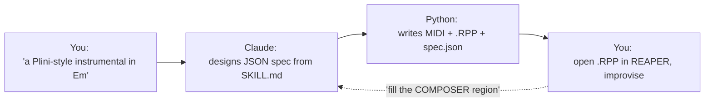

<p align="center">
  
</p>

<h1 align="center">claude-composer</h1>

<p align="center">
  <em>A bandmate that hands you sketches.</em>
</p>


<center>
<a href="https://youtu.be/sGqa-7_V1t8">Demo</a>
</center>

<p align="center">
  <a href="https://github.com/ricardoalcocer/claude-code-composer/actions/workflows/ci.yml">
    
  </a>
  
  <a href="https://alco.mit-license.org">
    
  </a>
  <a href="https://www.reaper.fm/">
    
  </a>
  
  <a href="https://claude.ai/code">
    
  </a>
</p>

<p align="center">
  Tell <a href="https://claude.ai/code">Claude Code</a> what you want to play over — a style, a mood, a chord change — and get back a <a href="https://www.reaper.fm/">REAPER</a> project with bass, drums, guitars, pad, and MIDI laid out across sections, regions, and tracks. Open it. Improvise over it. Mine it for ideas. Throw it away. Ask for another.
</p>

<p align="center">
  <strong>11 style packs</strong> &nbsp;·&nbsp; <strong>14 song forms</strong> &nbsp;·&nbsp; <strong>10 arrangement archetypes</strong> &nbsp;·&nbsp; all blendable
</p>

---

## How it works



The Python script does the mechanical RPP/MIDI work. Every musical decision — key, tempo, chord choices, form, feel-arc, arrangement, voicings — happens inside Claude, guided by the catalogs in [`SKILL.md`](SKILL.md).

## What it feels like

You're in Claude Code. You type:

> *Give me a Plini-style instrumental in Bm — through-composed, no lead, leave room for me to play over it.*

A few seconds later you have `~/Documents/MIDI-SONGS/_2026/.../blue-meridian.RPP` on disk — 48 bars across six unique sections, drums entering at the halftime setup, full band at the climb, a sparse bridge break in the middle, and a NOTES pane in REAPER that documents every chord and the scale to solo over it.

Then you decide the bridge needs more. In REAPER you drag a region named `COMPOSER` over 16 empty bars and ask:

> *Fill the COMPOSER region with a cinematic key mod.*

Claude reads what comes before and after the gap, picks a chromatic-mediant lift to D major then drops to Bb-major territory before walking back through B Aeolian, and writes the MIDI items into your project on bass, pad, clean, and synth pad — no drums, no rhythm guitars, because the brief said *cinematic*. The fill lands cleanly into the next chord on the other side.

That's the whole skill: a bandmate that hands you sketches.

## Two modes

| Mode | When | What you say | What you get |
|---|---|---|---|
| **Compose** | Starting fresh | *"a sad piano piece in 6/8"* · *"Polyphia-style loop"* · *"synthwave in Am"* · *"Zaza meets Casiopea in Em"* | A fresh `.RPP` + per-section `.mid` files + `full.mid` + `spec.json`, in a dated output folder |
| **Fill** | Filling a gap in an existing project | *"fill the COMPOSER region"* · *"do a key mod here"* · *"arpeggiated guitars, 65bpm feel"* | MIDI items injected into the existing `.RPP` in place — only the tracks the fill needs, none of the others touched |

## Style packs

Each pack is a self-contained recipe — tempo range, default key, roles, feel archetypes, harmonic moves, voicings, what to avoid, and touchstones. Packs **blend at section boundaries** (*"Spanish bridge in a synthwave song"* is a valid brief).

### Melodic-rock family

<table>
  <tr>
    <th>Pack</th>
    <th>Touchstones</th>
    <th>Engine</th>
  </tr>
  <tr>
    <td><strong>Rock</strong> <sub>(default)</sub></td>
    <td>Satriani · Vai · Plini · Polyphia · Zaza</td>
    <td>Driving 8ths · modal minor · pedal tones · <code>bVI-bVII-i</code> lift</td>
  </tr>
  <tr>
    <td><strong>Math rock</strong></td>
    <td>American Football · TTNG · Toe</td>
    <td>7/8 · fingerpicked · maj7/9 voicings · open-tuning vocabulary</td>
  </tr>
  <tr>
    <td><strong>Post-rock</strong></td>
    <td>Mogwai · Explosions in the Sky · Caspian</td>
    <td>Sparse build → climax → ebb · Mogwai inversion</td>
  </tr>
  <tr>
    <td><strong>Cinematic</strong></td>
    <td>Hisaishi · Zimmer · Ólafur · Sigur Rós</td>
    <td>Sparse · piano-led · parallel-minor chorus · anti-cadence endings</td>
  </tr>
</table>

### Heavy / electronic / world

<table>
  <tr>
    <th>Pack</th>
    <th>Touchstones</th>
    <th>Engine</th>
  </tr>
  <tr>
    <td><strong>Djent</strong></td>
    <td>Periphery · Animals as Leaders · Meshuggah · Tesseract</td>
    <td><code>chugg: gallop</code> · <code>polyrhythm-3</code> · halftime breakdowns</td>
  </tr>
  <tr>
    <td><strong>Spanish / Phrygian</strong></td>
    <td>Rodrigo y Gabriela · Paco de Lucía</td>
    <td>Phrygian dominant · Andalusian cadence · <code>chugg: gallop</code></td>
  </tr>
  <tr>
    <td><strong>Synthwave</strong></td>
    <td>Carpenter Brut · Kavinsky · Mitch Murder · Stranger Things</td>
    <td><code>four-on-floor</code> · halftime feel · layered EDM build</td>
  </tr>
</table>

### Fusion family

<table>
  <tr>
    <th>Pack</th>
    <th>Touchstones</th>
    <th>Engine</th>
  </tr>
  <tr>
    <td><strong>Jazz-funk</strong> <sub>(American)</sub></td>
    <td>Snarky Puppy · Cory Henry · Tomo Fujita · Jack Thammarat</td>
    <td><code>pushed</code> feel · ii-V-i · Dorian / Lydian-dom · full voicings</td>
  </tr>
  <tr>
    <td><strong>Reggae-fusion</strong></td>
    <td>John Scofield · Steve Khan · Pat Metheny</td>
    <td><code>feel: skank</code> (upbeat chops) · <code>drums: one-drop</code> · modal-jazz harmony on top</td>
  </tr>
  <tr>
    <td><strong>Salsa-fusion</strong></td>
    <td>Michel Camilo · Hiromi · Eddie Palmieri · Steve Khan</td>
    <td><code>feel: montuno</code> (piano arpeggio) · <code>chugg: clave-3-2</code> · <code>drums: latin-fusion</code></td>
  </tr>
  <tr>
    <td><strong>J-fusion</strong></td>
    <td>Casiopea · T-Square · Naniwa Express</td>
    <td><code>feel: locked-16</code> · <code>drums: j-fusion-kit</code> (16th hi-hat) · <strong>composed lead mandatory</strong></td>
  </tr>
</table>

> [!TIP]
> The three "fusion" packs (Reggae, Salsa, J-fusion) are explicitly **non-authentic** — you lift the rhythmic engine and drop your own harmonic language on top. Lydian-dom over a skank. Dorian over a montuno. Modal-rock harmony under a locked-16. *The combinations are the whole point.*

## Requirements

<table>
  <tr>
    <td><strong>REAPER</strong></td>
    <td>Any recent version. The script writes <code>.RPP</code> project files you open directly. <a href="https://www.reaper.fm/">reaper.fm</a></td>
  </tr>
  <tr>
    <td><strong>Python 3.8+</strong></td>
    <td>Stdlib only — zero external dependencies, single file (<code>composer.py</code>).</td>
  </tr>
  <tr>
    <td><strong>REAPER template</strong></td>
    <td>A project template with specific track names. See <a href="#template-setup">Template setup</a>.</td>
  </tr>
  <tr>
    <td><strong>Claude Code</strong></td>
    <td>The driver. <code>composer.py</code> can also be run standalone with a hand-written JSON spec — see <a href="#standalone-usage">Standalone usage</a>.</td>
  </tr>
</table>

## Install

```bash
# 1. Clone into your Claude Code skills directory.
git clone https://github.com/ricardoalcocer/claude-code-composer.git ~/.claude/skills/composer

# 2. Set up your local config + personal-notes scratchpad (both gitignored).
cd ~/.claude/skills/composer
cp config.example.json config.json
cp style.example.md style.md
$EDITOR config.json   # edit template_path and output_root
```

Restart Claude Code and the `composer` skill is discoverable. Try:

> *Compose a melodic instrumental rock piece in Bm — make the bridge a halftime breakdown.*

## Template setup

The script doesn't create instrument tracks — it inserts MIDI items into tracks **you have already set up** in a REAPER project template. That way your synths, FX chains, sends, and mixer balance are exactly the way you like them; the skill just supplies the notes.

In REAPER, create the tracks below with these **exact names**, save as a project template (`File → Project templates → Save project as template…`), and point `template_path` in `config.json` at the resulting `.RPP`.

| Track name | Role | What gets written |
|---|---|---|
| `BASS` | bass | Root-note bassline. Splits long chords in two for movement. |
| `DRUMS` | drums | GM kit (kick 36, snare 38, hat 42), crash at section starts. New: cowbell, congas, claves, timbales for Latin/reggae patterns. |
| `PIANO` | pad | Open chord voicings, sustained for the full chord duration. Triggers a **montuno arpeggio** when `feel: montuno` is set. |
| `MIDI-RHY-GTR-L` | rhy_l | Root+5th power chords (or full voicings for jazz/fusion). Pattern from `feel`. |
| `MIDI-RHY-GTR-R` | rhy_r | Same as L, offset 1/8 beat for stereo width. |
| `MIDI-CLEAN` | clean | 8th-note fingerpicked arpeggios cycling chord tones. |
| `MIDI-STRUM` | strum | Staggered strum — chord tones offset ~40ms (pick rake). |
| `MIDI-LEAD` | lead | Composed melodic line per section (`melody` field). |
| `MIDI-CHUGG` | chugg | Palm-muted low-octave rhythm. Patterns: `gallop`, `straight-16ths`, `polyrhythm-3`, `syncopated`, `halftime`, `single-hit`, `open-8ths`, `clave-3-2`, `clave-2-3`. Drop a ReaPitch on this track to drop-tune. |
| `SURGE XT` | synth_pad | Soft sustained chord-tone bed. Long sustain blurs into next chord. |

Track names are matched exactly. **You don't need every track** — if your template has only `BASS`, `DRUMS`, and `PIANO`, the script writes those three and skips everything else. (The `.mid` files still contain every role as separate tracks, so you can drag-and-drop into any DAW.)

To use different track names, edit `TRACK_TARGETS` near the top of `composer.py`.

## Fill mode

You're working in a song. There's a gap — a section that needs something. Or maybe the bridge you wrote isn't landing and you want a second opinion. Fill mode is for that moment.

### Setup in REAPER

1. Find the empty bars. (Or clear existing MIDI items from a range.)
2. Press **R** to drop a region over those bars. Rename it `COMPOSER` (literal, all caps).
3. **Save and close the project.** The script rewrites the `.RPP` in place; REAPER would silently clobber the edits on its next auto-save if left open.

### Ask Claude

Three flavors of brief, all valid:

| Brief style | Example | What Claude does |
|---|---|---|
| **None** (Mode A) | *"fill the COMPOSER region"* | Reads prev/next 4 bars, picks a transition that fits — pre-chorus build, halftime breather, parallel-minor bridge, etc. |
| **Vibe-textural** | *"arpeggiated guitars, 65bpm feel"* · *"atmospheric"* · *"drop to silence"* | Keeps the surrounding harmonic frame; picks `feel` + `roles` to match the texture words. |
| **Harmonic** | *"do a key mod to F#m"* · *"Andalusian cadence"* · *"bVI-bVII-i lift"* · *"halftime breakdown"* | Composes the dictated progression; if a key changes, ends with a chord that lands cleanly into the next section. |

Reopen the `.RPP` in REAPER when it's done. The fill appears as items named `composer-fill-<role>` on the right tracks.

### Re-running for variations

If you don't love the result:

1. In REAPER, select the `composer-fill-*` items and delete them.
2. Save, close.
3. Ask again with a refined brief.

Each run replaces the `COMPOSER-FILL` entry in the project notes (so the description stays accurate). The MIDI items don't auto-replace though — that's the manual step.

### How it knows what's around the gap

When you run `analyze` on a project, the script tries four sources in priority order:

1. **EXTSTATE breadcrumb** inside the `.RPP` — embedded by `compose` (and updated by every `fill`). Invisible to you in REAPER's UI, perfect-fidelity record of the spec.
2. **Sidecar `spec.json`** in the project's output folder — written by `compose`, always.
3. **Project notes-block parsing** — every composer-authored `.RPP` has structured `chords:`, `move:`, `improv:`, and `roles:` lines per section.
4. **Raw MIDI parsing** — for projects you built by hand, the script falls back to extracting pitch sets from items in the surrounding bars and lets Claude infer chords.

Fill mode works on **every song you've ever composed with this skill**, even ones predating the EXTSTATE breadcrumb feature — the sidecar and notes-block tiers carry the day. The first fill on a legacy project even upgrades its breadcrumb to tier 1, so future analyses are exact.

## Configuration

Everything user-specific lives in `config.json` (gitignored). Two keys:

```json
{
  "template_path": "~/Library/Application Support/REAPER/ProjectTemplates/claude-composer.RPP",
  "output_root": "~/Documents/MIDI-SONGS"
}
```

| Key | Purpose |
|---|---|
| `template_path` | Path (`~/...` OK) to your REAPER template `.RPP`. The script reads, patches, and writes to your output folder. |
| `output_root` | Where compositions land: `<output_root>/_<YEAR>/composer/<week-folder>/<key>-<bpm>-<slug>/`. Key is lowercase with `#`/`b` and an `m` suffix for minor (`f#m`, `ebm`); bpm is zero-padded to 3 digits so `ls` sorts numerically. See [`SKILL.md §3`](SKILL.md) for the full rule. |

Want a personal scratchpad for "what I've found works"? Copy `style.example.md` to `style.md` — Claude reads it at the start of every composition, so guidance you give it persists across sessions. Example entries:

> *Don't default to halftime-verse/driving-chorus arcs.*
> *For Plini/Satriani context, use 8 distinct chord changes per section.*
> *I keep landing on Em — rotate keys.*

## File layout

```
~/.claude/skills/composer/
├── README.md                  ← you are here
├── SKILL.md                   ← the prompt Claude reads — style packs, song forms,
│                                arrangement archetypes, transition idioms, spec reference
├── composer.py                ← the generator (stdlib only, single file)
├── config.example.json        ← checked-in template
├── config.json                ← YOUR local paths (gitignored)
├── style.example.md           ← checked-in template
├── style.md                   ← YOUR scratchpad — preferences, what's worked (gitignored)
└── references.md              ← curated bibliography for the moves in SKILL.md
```

Each generated song goes to:

```
<output_root>/_<YEAR>/composer/<week-folder>/<key>-<bpm>-<slug>/
├── <slug>.RPP                 ← open this in REAPER
├── full.mid                   ← full-song arrangement, any DAW
├── <section>.mid              ← per-section MIDI files
└── spec.json                  ← the JSON spec that produced this song
```

Folder names use `<key>-<bpm>-<slug>` (e.g. `em-128-iron-mile`) so `ls` groups the directory first by key, then by tempo. The `<week-folder>` is optional — for one-offs you can put the song directly under `composer/` — but weekly sessions keep things organized.

`spec.json` is the most useful archive artifact. It captures every musical decision the skill made — key, tempo, form, feel-arc, arrangement, every chord. If a song works, you can read the spec to see why. If it doesn't, hand-edit the spec and re-run the generator.

## Standalone usage

You can drive `composer.py` directly without Claude.

**Compose:**

```bash
python3 composer.py compose /path/to/spec.json /path/to/output_dir
```

A minimal spec:

```json
{
  "song_name": "iron-mile",
  "key": "Em",
  "tempo": 135,
  "time_sig": [4, 4],
  "sections": [
    {
      "name": "verse",
      "feel": "halftime",
      "chords": [
        {"name": "Em9",   "beats": 4},
        {"name": "D",     "beats": 4},
        {"name": "Cmaj7", "beats": 4},
        {"name": "B7",    "beats": 4}
      ]
    },
    {
      "name": "chorus",
      "feel": "driving",
      "chords": [
        {"name": "C",   "beats": 4},
        {"name": "G",   "beats": 4},
        {"name": "D",   "beats": 4},
        {"name": "Em",  "beats": 4}
      ]
    }
  ],
  "form": ["verse", "chorus", "verse", "chorus"]
}
```

**Analyze + fill:**

```bash
# Dump the context JSON for a project with a COMPOSER region:
python3 composer.py analyze /path/to/song.RPP

# Then write a fill spec (one section + roles, beats must match region length):
python3 composer.py fill /path/to/fill_spec.json /path/to/song.RPP
```

Full spec field reference is in [`SKILL.md`](SKILL.md) — `roles`, `feel`, `voicing`, `move`, `scales`, `melody`, `melody_loop_beats`, `chugg`, `skip_roles`, plus the supported chord vocabulary.

> [!WARNING]
> **Always close the `.RPP` in REAPER before running `fill`.** The script rewrites the file in place; REAPER holds project state in memory while open and would clobber the changes on its next save.

## Philosophy

This is **an idea incubator, not a song finisher.** The output is rough on purpose. The point is to mine it for chord progressions you'd never have thought of on your own, drop yourself into an idiom you don't normally write in, and have something concrete enough to improvise over by the time you've poured a coffee.

Design choices that fall out of that:

- **Reach wider, not higher.** No drum fills. No walking basslines. No voice leading optimization. No per-note velocity ramping. The energy budget is spent on chord-choice and arrangement variety across genres, not on polishing one output.
- **Variety is enforced.** The skill scans recent outputs and deliberately rotates keys, forms, and arrangement archetypes. The `style.md` scratchpad lets you teach it your taste over time.
- **Musical decisions are Claude's job.** The Python script is dumb — it converts a JSON spec into MIDI and an `.RPP`. Every musical choice — what chords, what key, what feel-arc, what arrangement, what moves to reach for — happens inside Claude's reasoning, guided by the catalogs in [`SKILL.md`](SKILL.md).
- **The DAW is the destination.** The REAPER project is the artifact you actually live in. Per-section `.mid` files exist for cross-DAW portability; `spec.json` exists as the recipe you can hand-edit. Everything else is in service of the `.RPP`.

## Limitations

- No tempo or time-signature changes mid-song.
- Drum patterns are fixed bar-level — no fills, breakdowns, or builds.
- Chord parsing is strict — `C9sus4`, `Cmaj7#11`, and similar extended/altered chords will error. See the supported vocabulary in [`SKILL.md`](SKILL.md).
- No automation, no per-note velocity shaping beyond the built-in pattern defaults.
- The compose step is one-shot — re-running with the same spec overwrites the output `.RPP` / `.mid` / `spec.json`.

## License

<a href="https://alco.mit-license.org">MIT</a> © Ricardo Alcocer
